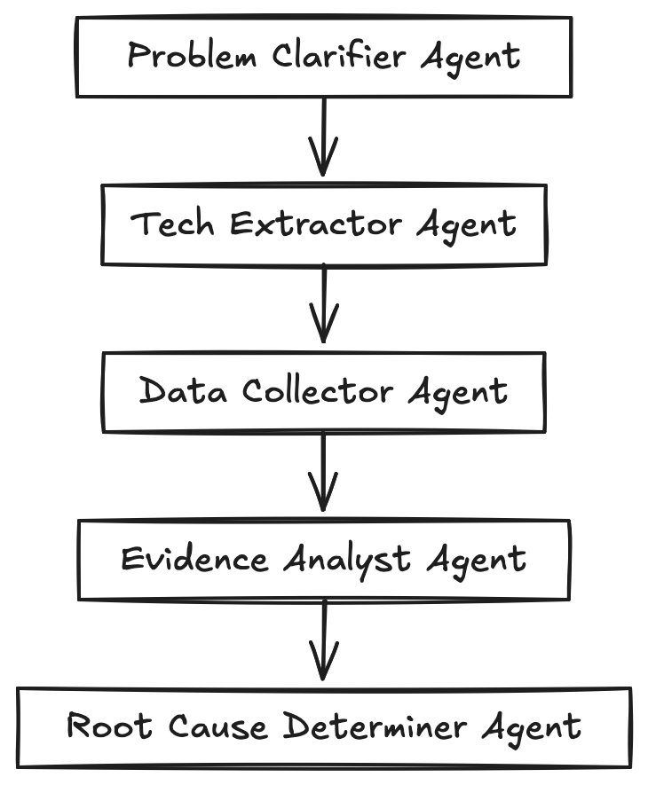

# **SONiC NOS MCP Server**
### AI-Powered Network Root Cause Analysis

**Team @htinoco from Amazon**
SONIC Hackathon 2025

---

# 🎯 **Project Overview**

Bringing **AI Agents** to **SONiC TechSupport Dumps** analysis through the **Model Context Protocol (MCP)**

### The Vision
Transform network root cause analysis from manual log analysis to **intelligent AI-powered workflows** that understand SONiC internals.

# 📦 **Complete Deliverables**

✅ **New SONiC NOS Open Source MCP Server** with TechSupport Dump Analysis Tools
✅ **vrnetlab Updates** for easier SONiC virtualization (PR Pending)
✅ **Pre-packaged Containerlab Images** (202411 & 202505)
✅ **Example Containerlab Topology** Check out the repo!
✅ **AI Agent Workflows** Strands Agent RCA Workflow
✅ **LLM Evaluation Framework** LLM Judge + Test Cases
✅ **Docker & uvx Deployment** Github Actions Pipelines ..in Action!

---

# 🏗️ **MCP Server Architecture**

```python
sonic-nos-mcp/
├── src/sonic_nos_mcp/
│   ├── module_base.py          # Extensible module system
│   ├── module_registry.py      # Auto-discovery
│   └── modules/
│       └── tech_support/       # First module
│           ├── tools/          # Extract, List, Read
│           ├── models/         # Pydantic schemas
│           └── resources/      # SONiC knowledge base
```

**Modular Design** → Easy to add new SONiC analysis capabilities

1 MCP server to rule them all - open to contributions!

---

# 🛠️ **Core MCP Tools**

### `extract_tech_support_file`
- Handles `.tar.gz`, `.zip`, `.tgz` archives
- Auto-extracts nested archives recusively
- Returns complete file inventory with metadata
- Cleans up empty files

### `list_tech_support_files_tool`
- Optional glob pattern filtering (`*.json`, `dump/*`)
- Directory structure navigation

### `read_tech_support_file`
- **Regex pattern matching** for targeted analysis
- **Automatic chunking** for large files
---

# 🔬 **Test Data & Scenarios**

### Detailed Scenario Breakdown:
- BGP peering on sonic1 was forced into an MD5 password mismatch against neighbor 10.255.0.2 before the capture
- docker kill syncd. Techsupport was taken while syncd was recovering
- Aggressive memory ballooning (python script) inside swss container triggered host-level panic-on-OOM

### Link to Test Data
📁 **[test/data/techsupport/README.md](test/data/techsupport/README.md)** - Complete scenario documentation

---

# 🎓 **Lessons Learned**

### What Worked ✅

- **Single Agent Performance**: Excelled with clear problem statements on both simple and complex scenarios. Not so much with vague prompts
- **Multi-Agent Workflows**: Better deep dive and correlation through task-specific agent specialization
- **MCP with Cline**: Provided insightful interactive guidance during analysis

### Challenges & Future Work ⚠️

- **Context Passing**: Required careful finesse to avoid hallucinations
- **Prompt Engineering**: Strict tone definitions needed for consistency
- **Next Steps**: Adding agent guardrails (e.g., enforcing tool use)

---



# 🤖 **AI Agent RCA Workflow**

### 5-Step Root Cause Analysis Pipeline
Using **Strands Agent Framework** with **Claude Sonnet 4.5**:

1. **Problem Clarification** - Focus analysis scope
2. **Tech Support Extraction** - Smart file discovery
3. **Targeted Data Collection** - Evidence gathering
4. **Evidence Correlation** - Cross-file analysis
5. **Root Cause Determination** - Definitive diagnosis

**Each step optimized with specialized agents executing MCP tools**

---

# 🤖 **Live Agent Demo Results**

### Real BGP Authentication Failure Analysis

**Single Agent Performance:**
- ✅ **Perfect Score**: 5/5 from LLM Judge evaluation
- ✅ **Root Cause Found**: MD5 authentication password mismatch ("wrongpw")
- ✅ **Complete Analysis**: Used MCP tool calls for comprehensive investigation
- ✅ **Expert Diagnosis**: Layer 2/3 connectivity verified, BGP-specific authentication issue identified

### Key Agent Capabilities Demonstrated:
- **Tech Support Extraction**: Automatically processed .tar.gz archive
- **Intelligent File Navigation**: Found relevant BGP configuration and logs
- **Cross-Reference Analysis**: Correlated CONFIG_DB.json with FRR configuration
- **Professional RCA Report**: Provided actionable resolution steps

### Performance Summary:
- Average Score: 5.0/5 (9 runs)
- Success Rate: 77.8% (2 out of 9 failed w/ token limitations from abusing claude)
- Avg Response: 254.6s

---
# 📈 **CLI Usage & Real-World Examples**

### Command-Line Interface
```bash
# BGP routing issue analysis
uv run python examples/invokeWorkflow.py \
  --prompt "BGP neighbor 10.255.0.2 keeps flapping" \
  --tech-support-file test/data/techsupport/techsupport_bgp_md5.tar.gz \
  --verbose

# Memory/OOM issue investigation
uv run python examples/invokeWorkflow.py \
  --prompt "System experiencing out of memory conditions" \
  --tech-support-file test/data/techsupport/techsupport_oom.tar.gz

# System crash analysis
uv run python examples/invokeWorkflow.py \
  --prompt "syncd process keeps crashing" \
  --tech-support-file test/data/techsupport/techsupport_syncd_crash.tar.gz
```

### Output: Professional RCA Reports
- **Root Cause Statement** with confidence level
- **Supporting Evidence** with file paths and content quotes
- **Timeline of Events** leading to failure
- **Contributing Factors** and secondary issues

---

# 🐳 **Containerlab Integration**

### Pre-built Images Available
- **SONiC 202411**
- **SONiC 202505**

### Example Topology
```yaml
# Two-node SONiC lab pinned to the 202411 image
name: sonic-duo-202411
prefix: clab

topology:
  nodes:
    sonic1:
      kind: sonic-vm
      image: h4ndzdatm0ld/sonic-vm:202411
      startup-config: ./configs/sonic1_config_db.json
    sonic2:
      kind: sonic-vm
      image: h4ndzdatm0ld/sonic-vm:202411
      startup-config: ./configs/sonic2_config_db.json
  links:
    - endpoints: ["sonic1:eth1", "sonic2:eth1"]
    - endpoints: ["sonic1:eth2", "sonic2:eth2"]
mgmt:
  network: sonic-mgmt
  ipv4_subnet: 172.20.20.0/24
```

**Ready for immediate testing** → No complex setup required

---

# 🚀 **Getting Started**

### Option 1: UV Development
```bash
git clone https://github.com/h4ndzdatm0ld/sonic-nos-mcp.git
cd sonic-nos-mcp
uv sync
```

### Option 2: Docker Production
```bash
docker pull ghcr.io/h4ndzdatm0ld/sonic-nos-mcp:latest
```

### MCP Client Configuration
```json
{
  "mcpServers": {
    "sonic-nos": {
      "command": "uv",
      "args": ["run", "sonic-nos-mcp"],
      "cwd": "/path/to/sonic-nos-mcp"
    }
  }
}
```

---
# 💡 **Why This Matters**

### AI-Powered SONiC Analysis
✅ **Intelligent pattern sharing through MCP resources**
✅ **Natural language queries**
✅ **Automated correlation**
✅ **Consistent analysis quality**

---

# 🛡️ **Enterprise Ready**

### Security & Reliability
- **No external API calls** - All processing local
- **Comprehensive logging** - Full audit trail

### Deployment Options
- **Docker containers** for production
- **UV development** for customization
- **MCP standard compliance** - Works with any MCP client

---

# � **CI/CD Pipeline & Automation**

### **Production-Grade Quality Gates**
✅ **Code Quality**: Ruff formatting + linting with auto-fix
✅ **Type Safety**: MyPy static type checking (100% coverage)
✅ **Test Coverage**: 90%+ requirement across unit & integration tests
✅ **Security Scanning**: Bandit static analysis + Safety vulnerability checks
✅ **Docker Quality Gates**: Multi-stage builds with embedded validation

### **GitHub Actions Workflows**
```yaml
# Runs on ALL branches for testing
- Quality Gates: Ruff → MyPy → Tests + Coverage
- Test Matrix: Python 3.11, 3.12, 3.13 cross-validation
- Docker Build: Quality gate validation + container testing
- Security Scan: Bandit + Safety automated vulnerability detection
```

### **GitHub Container Registry**
📦 **ghcr.io/h4ndzdatm0ld/sonic-nos-mcp:branch-name** - Every branch published for testing

---

# 🎪 **Demo Time**

### Live Analysis Scenarios

1. **BGP MD5 Authentication Failure**
2. **Container Crash Investigation**
3. **Memory Exhaustion Analysis**
4. **Interface Status Troubleshooting**

**Watch AI agents analyze real SONiC tech support files** 🔍

---

# 🤝 **Open Source & Community**

### Repository
📂 **https://github.com/h4ndzdatm0ld/sonic-nos-mcp**

---

# 📞 **Thank You!**

## **Questions & Discussion**

### Team @htinoco from Amazon
#### SONIC Hackathon 2025

Reach out on linkedin -> https://www.linkedin.com/in/hugo-tinoco

---

### Resources

📦 **MCP Server:** https://github.com/h4ndzdatm0ld/sonic-nos-mcp
🧪 **ContainerLabs:** https://github.com/h4ndzdatm0ld/clab-sonic
🐳 **SONiC Images:** https://hub.docker.com/repository/docker/h4ndzdatm0ld/sonic-vs/general

---
